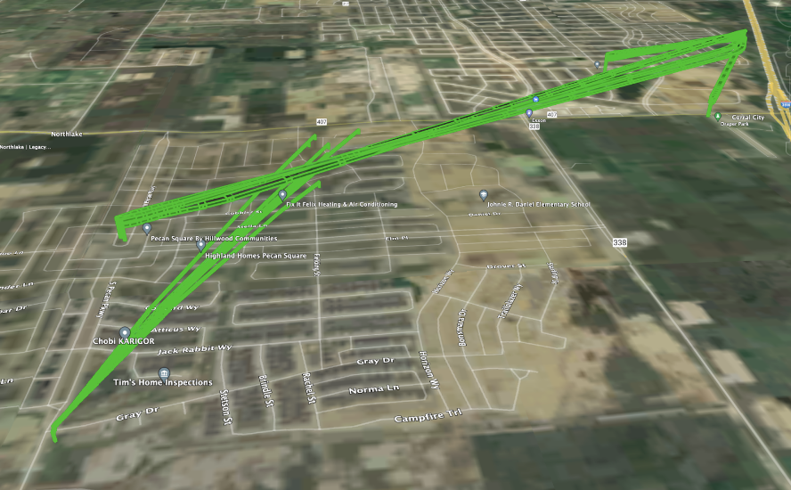

# US Shared Airspace

UAS Traffic Management (UTM) implementation in the US is the operationalization of UTM services to support complex UAS operations, with an initial focus on furthering shared airspace.

## Recent Updates
+ August 30, 2024: [DSS Pooling Policy](dss-pooling.md) added. Governance agreement updated with revisions to Annex C.
+ July 16, 2024: FAQs updated.
+ July 8, 2024: Added [detailed onboarding information](onboarding.md) for prospective service provider applicants.
+ July 2, 2024: Uploaded v1.1 of the Service Description Document, and v1.1 of the Requirements Traceability Matrix. (links provided in next section)

## About the US UTM Implementation

Shared airspace is the digital coordination of intended UA flight paths with overlapping operators in support of FAA Order 8040.6A and complex operations. This implementation of shared airspace leverages the strategic conflict detection and aggregated conformance monitoring services (collectively identified as strategic coordination) defined in [ASTM F3548-21 Standard Specification for UAS Traffic Management (UTM) UAS Service Supplier (USS) Interoperability](https://www.astm.org/f3548-21.html). These services are expected to be accepted by the FAA per the [Near Term Approvals Process (NTAP)](https://www.faa.gov/uas/advanced_operations/traffic_management) and incorporate participation and feedback from the FAA and NASA. Participants include Service Providers and Operators with the need to reduce UA to UA risk and who have signed the agreement available on this page.

Shared airspace is built around these guiding principles:

1. Safety first!
2. We will establish and abide by collaborative operating practices to enable the safe and efficient use of shared airspace by UAS operators.
3. We will support and enable a US-wide approach for UTM.
4. We will implement services based on mutually agreed requirements for performance, security, privacy, and quality based on industry consensus standards.
5. We will establish processes to evolve and adapt services based on operational learnings and needs.
6. We will proactively monitor and manage service and operator conformance to mutually agreed requirements.
7. We will eliminate barriers to entry by individuals and organizations by establishing performance-based onboarding criteria.
8. We will establish transparent and fair governance processes that value consensus building and provide equal voting rights to members.
9. We will foster transparency with and invite feedback from regulators and other stakeholders.

With performance-based criteria, UTM service providers and their operators can participate via key documents, which include onboarding instructions, available below:

* [UTM Service Provider Data Sharing and Governance Agreement Template](./docs/USP_Agreement_UTMImplementationUS_Template_Github.pdf) (includes onboarding information)
* [Service Description Document for Strategic Coordination](./docs/UA-UA_Strategic_Coordination_Service_Description_Document_V1.1.pdf)
* [Requirements Traceability Matrix for Strategic Coordination](./docs/Strategic_Coordination_Compliance_Matrix_V1.1.xlsx)

## Frequently Asked Questions

[Click here](faqs.md) for answers to frequently asked questions about the US UTM Implementation.

## How to Get Started

Participation in the shared airspace ecosystem enables collaboration, communication, and governance of shared airspace, aiming to integrate strategic coordination services to enable dense, overlapping BVLOS operations. This section provides an overview of the steps to join the US UTM Implementation.

+ [Consult this page for the specific onboarding steps that are required](onboarding.md), including how to sign the governance agreement, and required timelines for completing the steps.

As a participant, you will be able to leverage shared operational and governance resources to develop, verify, and advance your approach to sharing the airspace. This is an opportunity to learn from collaborative efforts and participate in democratized foundations of a shared airspace.

As a service provider, you can service operators by conveying digital intent and deconflicting flight paths. With revised FAA requirements for risk mitigation, and meeting industry-consensus standards, shared airspace offers a digital, transparent, and scalable process.

The ecosystem is open to service providers and their operators. Providers of UTM services, including private and public entities and organizations, are eligible and encouraged to join this agreement. Here are the steps and gate milestones to getting started:

<table>
    <tr>
        <th rowspan="2">Gate</th>
        <th colspan="3">Gate Exit Criteria</th>
    </tr>
    <tr>
        <th>Service Provider</th>
        <th>Operator</th>
        <th>Joint</th>
    </tr>
    <tr>
        <td>GATE 1: Qualification Testing</td>
        <td>
            <ul>
                <li>Implement the service requirements in accordance with the applicable service description document</li>
                <li>Pass automated testing (own system only)</li>
            </ul>
        </td>
        <td>N/A</td>
        <td>N/A</td>
    </tr>
    <tr>
        <td>GATE 2: Simulation</td>
        <td>
            <ul>
                <li>Pass automated testing (ecosystem)</li>
            </ul>
        </td>
        <td>N/A</td>
        <td>
            <ul>
                <li>Integrate service provider and operator systems</li>
            </ul>
        </td>
    </tr>
    <tr>
        <td>GATE 3: Production Flights</td>
        <td>
            <ul>
                <li>Pass automated testing (ecosystem) as a part of the software release process</li>
            </ul>
        </td>
        <td>
            <ul>
                <li>Validate operational practicality through overlapping airspace simulation</li>
            </ul>
        </td>
        <td>N/A</td>
    </tr>
</table>

_Source: Annex B - Onboarding Gates, UTM Service Provider Data Sharing and Governance Agreeement_

[BECOME A PARTICIPANT](https://forms.gle/3SgLJ6jnj9PVeDSF6)

## Current Activities

Participants in the current collaboration stemming from the active drone delivery market in North Texas are onboarding to or actively participating in simulations representing true, day-in-the-life operations. These simulations will progress to live flights in the coming months (mid-2024). Companies have reached consensus on governance and data sharing, and have signed and implemented agreements that are publicly available on this page. This is known as the North Texas Shared Airspace Implementation.

## Background

Following the momentum around scaled UAS services, particularly around drone delivery, in the greater North Texas area in late 2023 and early 2024, several operators noted the inherent need to communicate amongst each other. Prior FAA and NASA projects like the [UTM Field Test](https://www.faa.gov/uas/research_development/traffic_management/field_test), [UTM Pilot Program](https://www.faa.gov/uas/research_development/traffic_management/utm_pilot_program), UTM Technical Capability Levels, and other efforts had already provided frameworks for deploying strategic coordination services in an operational environment.

Understanding the need to share airspace amongst scaled operations and leverage applicable standards, seven operators engaged in a project to operationalize strategic conflict detection in the Dallas-Fort Worth area, including DroneUp, Flytrex, Manna, Prime Air, UPS Flight Forward, Wing, and Zipline, with ANRA Technologies as a service provider. Initial activities are coordinated by the Virginia Tech Mid-Atlantic Aviation Partnership and leverage contributions from Global UTM Association (GUTMA) and the InterUSS Platform. The effort is applicable to UTM across the US.

## Open Source Approach

This Github repository of publicly available resources promotes the development of an open source solution, while facilitating transparency and enabling ongoing updates from new data and learnings.

Additionally as part of this implementation, the participants have evaluated and integrated open source tools and documents. Those include resources from the [Global UTM Association](https://gutma.org/) and the [InterUSS Platform](https://interussplatform.org/) (Linux Foundation).
